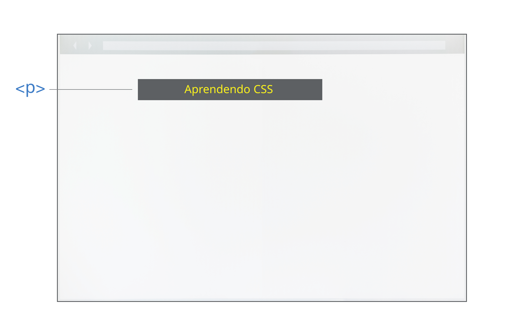
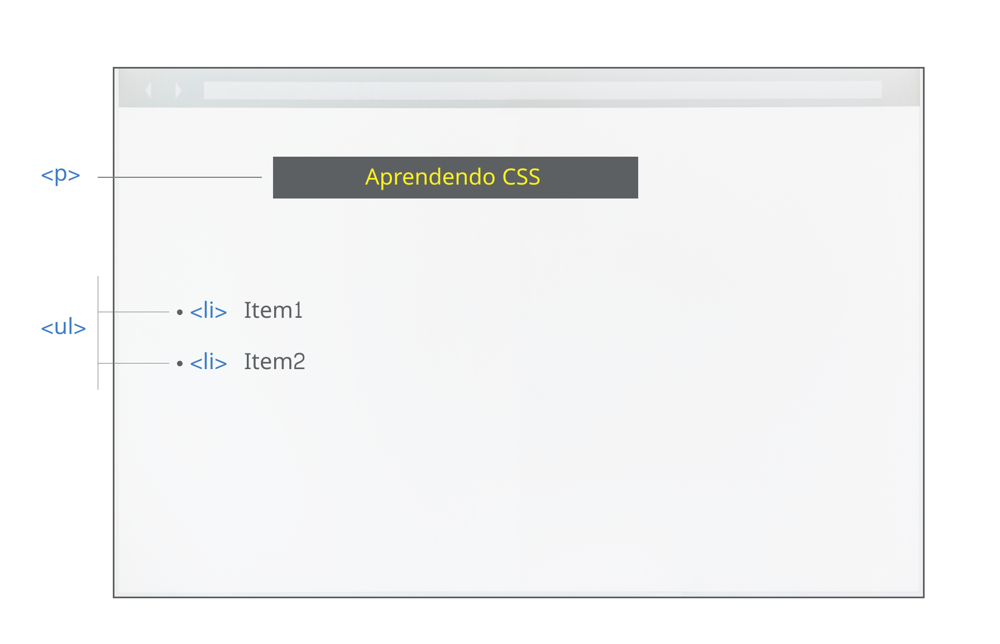
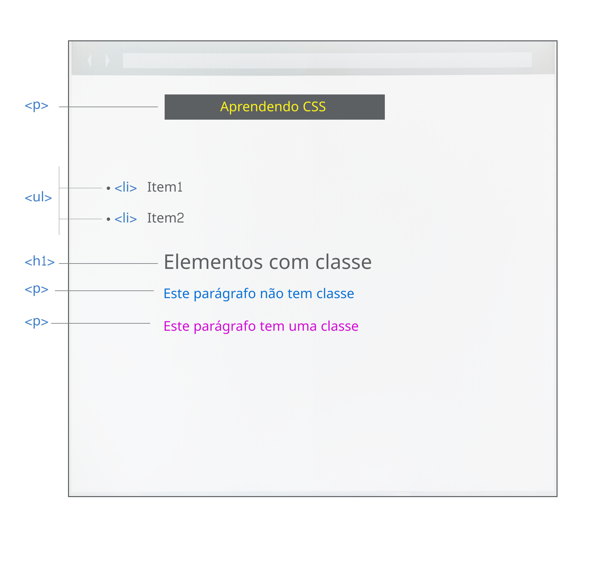
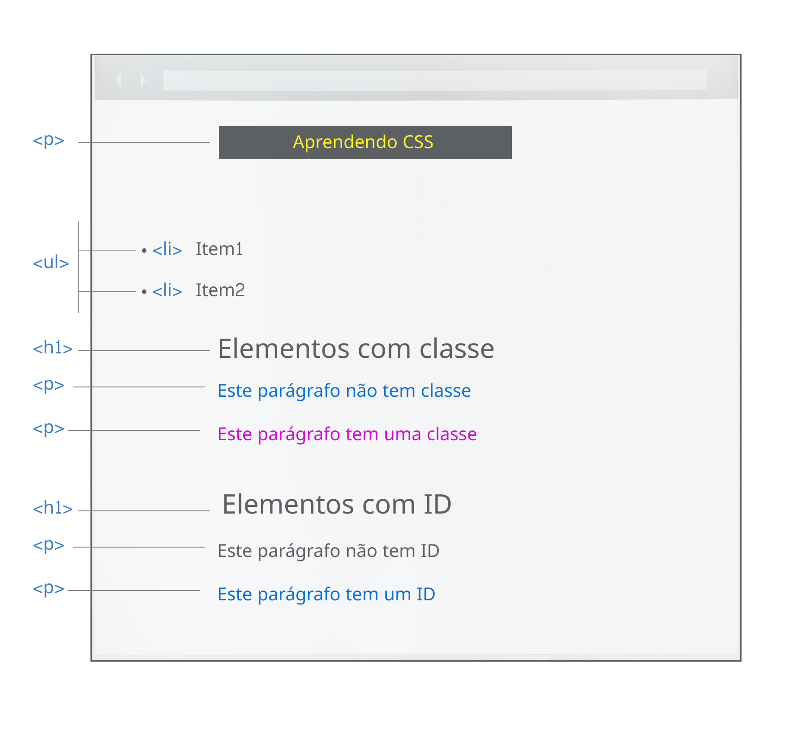
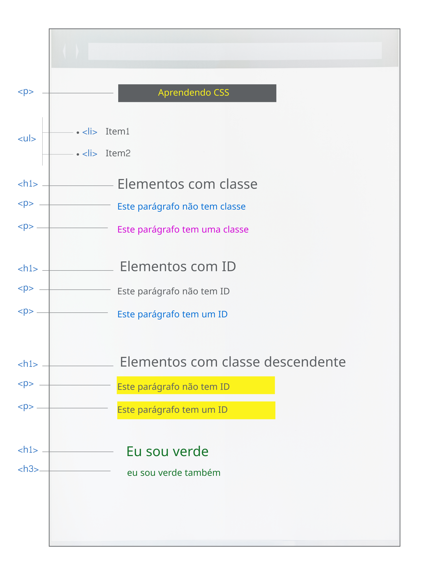
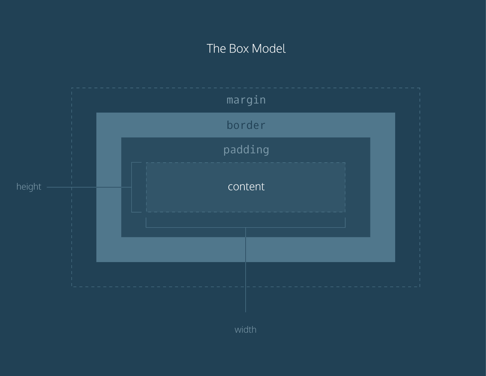
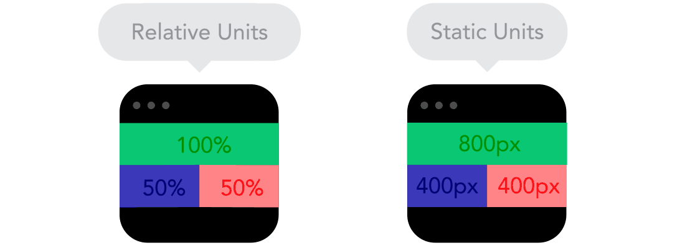

# CSS

## O que é CSS?


**CSS** \(Cascading Style Sheets\) é uma linguagem declarativa que controla a apresentação visual de páginas web em um **navegador**. O navegador aplica as declarações de estilo CSS aos elementos selecionados para exibi-los apropriadamente. Uma declaração de estilo contem as propriedades e seus valores, que determinam a aparência de uma página web.

Para começar, você deve criar uma pasta chamada css e dentro dela, você irá criar um arquivo chamado _**style.css**_


## Adicionando CSS no seu HTML

Podemos adicionar o nosso CSS ao documento HTML de três maneiras:

### Tag &lt;style&gt;

Podemos usar a tag `<style>` para estilizar nossas páginas. Só precisamos adicionar a tag dentro do nosso `<head>` no documento HTML.

```markup
<!DOCTYPE html>
<html lang="en">
<html>
  <head>
  <!-- Adicionando a tag style para estilizar a página -->
    <style>
      .box-red {
        background-color: black;
        width: 100px;
        height: 100px;
      }
    </style>
  </head>
  <body>
    <div class="box-black">
     <p>BOX</p>
    </div>
  </body>
</html>
    
```

### Style Inline

O atributo _style_, também conhecido como style inline, é um atributo que usamos dentro das nossas tags para estilizá-las. Para utilizarmos, basta adicionarmos o atributo style dentro da nossa tag no HTML.

```markup
<html>
  <head>
    <title>CSS Inline</title>
  </head>
  <body>
    <div class="box-black">
    <!-- Adicionamos o atributo style aqui para podermos 
    estilizar nossa tag -->
     <p style="color:black;">BOX</p>
    </div>
  </body>
</html>
```

### Style externo -  Usando o `<link>`

Essa é a mais recomendada forma de trabalhar com o CSS e consiste em usar a tag `<link>` para fazermos uma ancoragem entre nosso documento HTML e nosso arquivo .css

```markup
<html>
  <head>
   <!-- Aqui adicionamos a tag link, com referência para 
   nosso arquivo CSS -->
   <link rel="stylesheet" href="css/style.css">
  </head>
  <body>
    <div class="box-red">
     <p style="color:red;"> Box </p>
    </div>
  </body>
</html>
```

Na tag [`<link>`](https://developer.mozilla.org/en-US/docs/Web/HTML/Element/link)  são passados dois atributos:

* `rel="stylesheet" :`diz ao browser que temos uma "folha de estilos" \(stylesheet\) 
*  `href="css/style.css` : é a referência de onde eu arquivo de estilos está \(nesse caso, está na pasta css e o arquivo se chama _style.css_

O Link do CSS sempre deve ser colocado _abaixo_ da tag **`<title>Document</title>`** 

## Seletores CSS

Uma regra CSS é um conjunto de **propriedades** associados a um **seletor**. 


#### Seletor \(Selector\)

O nome do elemento HTML no começo do conjunto de regras. Ele seleciona o\(s\) elemento\(s\) a serem estilizados \(nesse caso, elementos [`<p>`](https://developer.mozilla.org/pt-BR/docs/Web/HTML/Element/p)\). Para dar estilo a um outro elemento, é só mudar o seletor.

#### Declaração \(Declaration\)

Uma regra simples como `color: red;` especificando quais das **propriedades** do elemento você quer estilizar.

#### Propriedades \(Property\)

Forma pela qual você estiliza um elemento HTML. \(Nesse caso, `color` é uma propriedade dos elementos [`<p>`](https://developer.mozilla.org/pt-BR/docs/Web/HTML/Element/p).\) Em CSS, você escolhe quais propriedades você deseja afetar com sua regra.

#### Valor da propriedade \(Property value\)

À direita da propriedade, depois dos dois pontos, nós temos o **valor de propriedade**, que escolhe uma dentre muitas aparências possíveis para uma determinada propriedade \(há muitos valores `color(cor)` além do `red(vermelho)`\).

#### Note outras partes importantes da sintaxe:

* Cada linha de comando deve ser envolvida em chaves \(`{}`\).
* Dentro de cada declaração, você deve usar dois pontos \(`:`\) para separar a propriedade de seus valores.
* Dentro de cada conjunto de regras, você deve usar um ponto e vírgula \(`;`\) para separar cada declaração da próxima.

Aqui está um exemplo que faz com que todos os parágrafos HTML fiquem amarelos num fundo preto:

```markup
<!DOCTYPE html>
<html>
  <head>
    <title>Curso Front-End</title>
  </head>
  <body>
    <p>Aprendendo CSS.</p>
    <ul>
      <li>Item 1</li>
      <li>Item 2</li>
    </ul>
  </body>
</html>

```

```css
/* O seletor "p" indica que todos os paragrafos no documento 
serão afetados por essa regra */

p {
  color: yellow;
 background-color: gray;
}

/* A propriedade "color" define a cor do texto, neste caso 
  amarelo. */
  
/* A propriedade "background-color" define a cor ao fundo, 
  neste caso preto. */
  
```



 Você pode adicionar múltiplos seletores de uma vez, separando com uma vírgula. Se você quiser que todos os parágrafos e todas as listas tenham a cor verde, deve ser feito assim:

```css
p, li {
    color: gray;
    }
```

## Mudando o comportamento de um elemento

Quando usamos a tag &lt;li&gt; ela tem um comportamento padrão de:



Usando a propriedade list-style, você modificar o marcador \(deixá-lo como ponto, como quadrado, entre outros\) e pode fazê-lo desaparecer usando o valor `none`.  
Veja mais : [`list-style-type`](https://developer.mozilla.org/en-US/docs/Web/CSS/list-style-type) 

```css
li {
    list-style: none;
    }

```


## Adicionando uma classe `.classname` 

Até agora vimos como estilizar os elementos com base em seus nomes de elementos de HTML e isso funciona se todos os parágrafos, títulos e listas do site tiverem o mesmo estilo. Na maioria das vezes, esse não é o caso e, portanto, você precisa encontrar uma maneira de selecionar um subconjunto dos elementos sem alterar os outros. A maneira mais comum de fazer isso é adicionar uma classe ao elemento HTML. 

Com a classe permite atribuir formatação a VÁRIOS elementos de uma vez só.

```markup
 <div>
     <h1>Elementos com classe</h1>
     <p>Este parágrafo não tem classe</p>
     <p class="paragrafo">Este parágrafo tem uma classe</p>
 </div>
```

No CSS, nós vamos referenciar a classe deste modo:

```css
h1 {
    color: #5D6063
}

p {
    color: #0C71D6;
}

.paragrafo {
    color: #D20CD6;
}
```



## Seletores ID `#idname`

Crie um ID e anexe-o a uma tag HTML para fazer com que o estilo apareça.

As ids são uma forma de identificar um elemento, e devem ser ÚNICAS para cada elemento ou seja  Cada elemento pode ter apenas um ID. IDs são os estilos mais específicos e substituentes de elementos e classes. Atualmente, os IDs não são usados em CSS.

```markup
 <div>
     <h1>Elementos com ID</h1>
     <p>Este parágrafo não tem ID</p>
     <p id="paragrafocomID">Este parágrafo tem um ID</p>
 </div>
```

```css
h1 {
    color: #c1c1c1;
}

p {
    color: royalblue;
}

#paragrafocomID {
    color: black;
}
```



## Seletores Descendentes `.classname element {}`

Essa é uma combinação de uma ou mais classes, IDs ou elementos, separados por espaços, para indicar um relacionamento familiar.

```markup
 <article class="seletor_desc">
     <h1>Elementos com ID</h1>
     <p>Este parágrafo não tem ID</p>
     <p>Este parágrafo tem um ID</p>
 </article>
```

```css
.seletor_desc h1{
    color:  #5D6063;
}

.seletor_desc p{
  background-color: yellow;
  color: #5D6063;

}
```


## Agrupando Seletores

Vamos colocar o H1 e o H3 na cor: Verde

```css
 <article>
     <h1>Eu sou verde</h1>
     <h3>Eu sou verde também</h1>   
 </article>
```

```css
h1, h3 { color: green; }
```



Vamos colocar  a cor **Azul**  na tag`H6` que está dentro `<section>` :

```markup
<section>
  <h6>Eu sou Azul</h6>
</section>
<h6>Não Sou Azul </h6>
```

```css
section h6 { color: #0C71D6; }
```


## Fontes e Textos

Agora que exploramos algumas noções básicas de CSS, vamos começar a adicionar mais regras e informações no nosso arquivo`style.css` para deixar nosso exemplo bonito. Vamos começar fazendo nossas fontes e textos parecerem um pouco melhores.

[https://fonts.google.com/](https://fonts.google.com/)

Existem dois jeitos de importar uma fonte para o seu projeto:

1.  Você pode usar o link no HTML
2. Você pode usar o @import no CSS

## Layout \(Box Model\)

Todos os elementos em uma página da web são interpretados pelo navegador como dentro de uma caixa. Isto é o que se entende por modelo de caixa. Por exemplo, quando você altera a cor de fundo de um elemento, altera a cor de fundo de sua caixa inteira. Portanto cada elemento HTML, `<h1>...<h6>`, `<p>,` `<ul><ol>`, `<form>`, `<div> considere que encontra-se dentro de uma caixa.`

**Vamos ver o exemplo abaixo:**

```markup
<h1>Introducção ao CSS</h1>

<h3>Aprendendo Box Model</h3>

<p> 
CSS (Cascading Style Sheets) é uma linguagem declarativa que controla a apresentação visual de páginas web 
em um navegador.O navegador aplica as declarações de estilo CSS aos
os elementos selecionados para exibi-los apropriadamente. 
Uma declaração de estilo contem as propriedades e seus valores,
que determinam a aparência de uma página web.
</p>

<p>
Agora que exploramos algumas noções básicas de CSS, 
vamos começar a adicionar mais regras e informações no nosso arquivo 
style.css para deixar nosso exemplo bonito. 
Vamos começar fazendo nossas fontes e textos parecerem um pouco melhores.
</p>
```

_Observando o exemplo acima, visualize cada elemento HTML  como quatro caixas empilhadas._

O "modelo de caixa CSS" é um conjunto de regras que definem como todas as páginas da Web na Internet são renderizadas. O CSS trata cada elemento do seu documento HTML como uma "caixa" com várias propriedades diferentes que determinam onde ele aparece na página. 

Como esperado, o layout CSS é baseado principalmente no _modelo de caixas_. Cada um dos blocos que ocupam espaço na sua página tem propriedades como essas:  
  
    **O que consiste em uma caixa:**

* `padding:` o espaço ao redor do conteúdo \(ex.: ao redor do texto de um parágrafo\).
* `border:` a linha sólida do lado de fora do padding.
* `margin:`o espaço externo a um elemento.
* `content:` o conteúdo da caixa.



## Height e Width:

O conteúdo de um elemento tem duas dimensões: uma altura e uma largura. Por padrão, as dimensões de uma caixa HTML são definidas para conter o conteúdo bruto da caixa.  
  
a propriedade `height`e as `width`podem ser usados ​​para modificar essas dimensões padrão.

```css
p{
 width:240px;
 height:80px;
}
```

## Border:

Uma _borda_ é uma linha que envolve um elemento, como uma moldura em torno de uma pintura. Fronteiras pode ser definido com um específico `width`, `style`e `color`.  
  
`width`- A espessura da borda. Espessura de uma borda pode ser definida em pixels ou com um dos seguintes palavras-chave: `thin`, `medium`ou `thick`.  
  
`style`- O design da fronteira. Os navegadores da Web podem renderizar qualquer um dos [10 estilos diferentes](https://developer.mozilla.org/en-US/docs/Web/CSS/border-style#Values) . Alguns destes estilos incluem: `none`, `dotted`, e `solid`.  
  
`color`- a cor da borda. Os navegadores da Web podem renderizar cores usando alguns formatos diferentes, incluindo [140 palavras-chave coloridas](https://developer.mozilla.org/en-US/docs/Web/CSS/color_value) .

```css
p{ border: 3px solid coral;}
```

No exemplo acima, a borda tem uma largura de 3 pixels, um estilo `solid`e uma cor de `coral`. Todas as três propriedades são definidas em uma linha de código.

## Border-radius:

Você pode modificar os cantos da caixa de borda de um elemento com a propriedade `border-radius`

```css
div.container {
  border: 3px solid rgb(22, 77, 100);
  border-radius: 5px;
}
```

O código no exemplo acima definirá _todos os quatro cantos_ da borda com um raio de 5 pixels \(ou seja, a mesma curvatura que um círculo com raio de 5 pixels teria\).

Você pode criar uma borda que seja um círculo perfeito, definindo o raio igual à altura da caixa ou a `100%`.

```css
div.container {
  height: 60px;
  width: 60px;
  border: 3px solid rgb(22, 77, 100);
  border-radius: 100%;
}
```

O código no exemplo acima cria um `<div>`círculo perfeito.

## 

## Tipos de Box Model

Existem dois tipos de modelo de caixa que você encontrará no CSS: o modelo de caixa de conteúdo e o modelo de caixa de borda.

### Content Box:

O modelo da caixa de conteúdo é o que é usado por padrão pelo CSS. No caso do modelo da caixa de conteúdo, a propriedade  **width** no CSS refere-se à largura do conteúdo. Para determinar a largura total da caixa, adicione o padding e margin da esquerda e / ou direita que possam estar presentes. De acordo com o código abaixo, o tamanho total dessa caixa seria: 244px


```css
div {
  color: #FFF;
  background-color: #5995DA;
  font-weight: bold;
  padding: 20px;
  text-align: center;
  border: 2px solid #5D6063;
  border-radius: 5px;
  
  width: 200px;
  box-sizing: border-box;  /* Add this */
}
```

### Border-box:

O modelo da caixa de borda diz algo diferente sobre a propriedade width, que a margin e padding não está incluída, ou seja implementando a propriedade box-sizing: border-box o tamanho da sua caixa é 200px.  


 exemplo no [codepen](%20https://codepen.io/karinamachado/pen/LYpBEQj)

## O que é Responsividade?

Sabemos que o uso de dispositivo móvel para navegar na internet está crescendo cada vez mais, sempre estão lançando novos dispositivos e a cada dispositivo temos tamanho de tela diferentes, resoluções. maneiras de visualizar seja portrait ou landscape.  
  
Diante dessa situação, quando estamos desenvolvendo nosso website, temos que fazer com que o conteúdo responda ao tamanho da tela do dispositivo, dessa forma, garantindo que o visitante do site tenha uma boa navegabilidade.   
  
Uma grande parte do processo para que seu site fique responsivo, está bem antes de implementar somente técnicas de breakpoints e consulta de mídias, para deixar o design responsivo, é interessante saber alguns princípios quando você está desenvolvendo o seu website para que seu conteúdo se apresente de uma forma bacana em todas as resoluções. 

## 1\) Responsivo x Adaptativo


### Design Responsivo.

E um design fluido, que se adapta ao tamanho da tela que deseja, independente do dispositivo, utiliza consulta de mídia css \(@screen, @print\) para alterar estilos com o foco no dispositivo desejado.


### Design Adaptativo.

Usa layouts estáticos baseados em pontos de interrupção de quebra \(breakpoint\) que não respondem até que sejam inicialmente carregados.

O adaptativo detecta o tamanho da tela e carrega o layout apropriado para ele, um site adaptável tem vários tipo de tela \( 320px, 480, 760px, 1200px, 1600px\). 

Ex: em uma tela desktop de 1366px de largura que é o padrão hoje na web, se estiver navegando um um dispositivo mobile um Android ou Iphone, uma conexão 3G ou 4G, você pode ter uma cópia de imagem e transformando em uma miniatura e nessa resolução seja exibido de acordo com a proporção do dispositivo e também em um tamanho menor ex: 320px ou 400px.

De acordo com o elemento que está trabalhando ou com a resolução você pode utilizar as duas técnicas, de uma forma que não prejudique a navegação do usuário e a aparência.

Enfim, não quer dizer que uma técnica é mais correta  ou melhor que a outra, você pode estar utilizando umas das duas em seu projeto.  


### Unidade de Medidas Relativas x Fixas



Pela imagem acima, já percebemos a diferença em usar medida relativa ou fixa no seu CSS, mas é importante saber em que momento vamos usar unidade relativa ou fixa, então se você criar um container de conteúdo, você vai utilizar porcentagem % nesse caso, afinal vai ter que encaixar dois ou mais elementos e cada um vai ter a sua proporção dentro da área útil.

Agora quando você estiver trabalhando com espaçamento interno ou externo, não é vantagem usar porcentagem % pelo motivo de renderização nos navegadores, ex: se visualizar no chrome, vai se comportar bem, porque vai conseguir interpretar. o % da margin e padding, já no firefox ou edge, como não tem um contexto fixo, uma altura por exemplo esses navegadores não vão conseguir calcular um percentual baseado no elemento.Portanto o ideal é trabalhar com unidades estáticas para espaçamento internos e externos, garantindo que o seu conteúdo fique distribuído de uma forma uniforme. 

**"em"** é uma medida relativa ao dispositivo, que no geral configura a mesma coisa que 16px. Portanto 1em == 16px, 1.2em == 19,2px...

### Breakpoints


É uma técnica que vamos utilizar muito para fazer o nosso design responsivo na nossa página, ou seja constitui na ação de redimensionar o seu navegador  e quando o conteúdo estiver fora da área, desalinhado, é onde você vai  usar ponto de quebra em uma determinada resolução e faz a alteração necessária e com isso você vai conseguir alinhar os elementos, esconder ou exibir.

A vantagem é que é totalmente flexível, embora já temos as medidas padrões que já sabemos dos dispositivos móveis seja, um android, iphone, tablet etc..., mas com o breakpoint podemos ajustar os elementos com uma nova medida.

### Valores Máximos e Mínimos


Olhando a animação acima, percebemos que utilizando a propriedade max-width, ou seja o valor máximo, quando o layout chega nesse valor o site para de esticar, o conteúdo ano vai ultrapassar a largura determinada.

A a maioria dos containers de conteúdo a dica é colocar max-width.  
  
Ex: max-width: 1300px, mas numa resolução 768px que é um tamanho de um tablet/ipad o conteúdo vai ajustar ocupando 100% da tela.

### Bitmaps x Vetores


Vetor é uma imagem que quando você expande para um tamanho grande ou pequeno ela não perde a qualidade da imagem, não distorce.

Imagem em bitmap como:  png, jpg, se tivermos uma imagem de 200px e aumentar para 800px, essa imagem será distorcida.

Mas não quer dizer que todas as imagens do meu site tem que ser em vetor , é interessante usar em logomarcas, menus e ícones. Para as imagens tipo png ou jpg é legal usar para foto de perfil, de artigo entre outros.

## Flexbox

 Foi projetado tanto como um modelo de _layout_ unidimensional quanto como um método capaz de organizar os elementos em uma interface, além de possuir capacidades avançadas de alinhamento.

#### Flex Container

O Flex Container é a tag que envolve os itens flex, ao indicar `display: flex`, essa tag passa a ser um Flex Container.

Vamos dar uma olhada neste site abaixo para exemplos!

[Guia Completo Flexbox](https://origamid.com/projetos/flexbox-guia-completo/)

## Referências

[CSS Básico](https://developer.mozilla.org/pt-BR/docs/Aprender/Getting_started_with_the_web/CSS_basico)   
https://developer.mozilla.org/pt-BR/docs/Aprender/Getting\_started\_with\_the\_web/CSS\_basico

[Como o CSS é estruturado](https://developer.mozilla.org/pt-BR/docs/Learn/CSS/First_steps/Como_CSS_e_estruturado)  
[https://developer.mozilla.org/pt-BR/docs/Learn/CSS/First\_steps/Como\_CSS\_e\_estruturado](https://developer.mozilla.org/pt-BR/docs/Learn/CSS/First_steps/Como_CSS_e_estruturado)

[Conceitos básicos de Flexbox](https://developer.mozilla.org/pt-BR/docs/Web/CSS/CSS_Flexible_Box_Layout/Conceitos_Basicos_do_Flexbox)  
[https://developer.mozilla.org/pt-BR/docs/Web/CSS/CSS\_Flexible\_Box\_Layout/Conceitos\_Basicos\_do\_Flexbox](https://developer.mozilla.org/pt-BR/docs/Web/CSS/CSS_Flexible_Box_Layout/Conceitos_Basicos_do_Flexbox)

[ORIGAMID - Conceitos Flexbox](https://origamid.com/projetos/flexbox-guia-completo/)  
[https://origamid.com/projetos/flexbox-guia-completo/](https://origamid.com/projetos/flexbox-guia-completo/)


